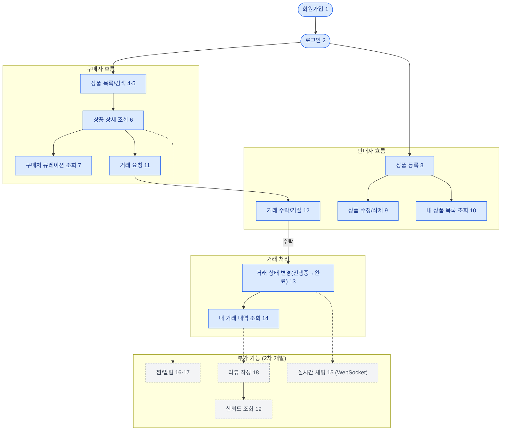

# 1. MVP 기획서 — 오시마켓 (Oshi Market)

**한 줄 정의**
서브컬쳐 굿즈 마니아를 위한 신뢰 기반 중고거래 + 구매처 큐레이션 플랫폼

**타겟 사용자**
- 서브컬쳐 굿즈를 사고파는 마니아층 (콜렉터, 라이트 유저)
- 특정 작품/캐릭터 굿즈를 찾는 신규 팬
- 판매자 (개인 셀러, 소규모 셀러)

## 서비스 흐름도 (User Flow)

파란색 = 핵심(MVP) 기능, 회색 점선 = 부가(2차) 기능

## 1. 서비스 흐름에 따른 전체 기능 나열

**계정**
1. 회원가입
2. 로그인 / 로그아웃
3. 내 프로필 조회 / 수정

**탐색 & 큐레이션**
4. 상품 목록 조회 (카테고리/작품/캐릭터 태그 필터)
5. 상품 검색 (키워드)
6. 상품 상세 조회
7. 작품/캐릭터별 구매처 큐레이션 조회

**판매**
8. 상품 등록
9. 상품 수정 / 삭제
10. 내가 등록한 상품 목록 조회

**거래**
11. 거래(구매) 요청
12. 거래 수락 / 거절
13. 거래 상태 변경 (진행중 → 완료 / 취소)
14. 내 거래 내역 조회 (구매/판매)
15. 구매자-판매자 실시간 채팅

**신뢰 & 관심**
16. 관심 상품 등록/해제 (찜)
17. 찜한 상품 알림 수신
18. 거래 후 리뷰 작성
19. 판매자 신뢰도(평점) 조회

## 2. 핵심 / 부가 기능 분류

| 구분 | 기능 | 사유 |
|---|---|---|
| 핵심 | 회원가입 / 로그인 (1, 2) | 서비스 이용 전제조건 |
| 핵심 | 상품 목록/검색/상세 조회 (4, 5, 6) | 서비스 핵심 가치(중고거래) 진입점 |
| 핵심 | 구매처 큐레이션 조회 (7) | 오시마켓 차별화 기능, 제품 정의 핵심 |
| 핵심 | 상품 등록/수정/삭제 (8, 9, 10) | 거래가 성립하려면 판매자 액션 필수 |
| 핵심 | 거래 요청/수락/상태변경 (11, 12, 13) | 중고거래 플랫폼의 본질 기능 |
| 핵심 | 내 거래 내역 조회 (14) | 거래 완결을 위한 최소 마이페이지 |
| 부가 | 실시간 채팅 (15) | **WebSocket 기반으로 구현 예정** (담당: yjdev101). MVP는 거래 상태값으로 대체 가능하지만, 기술적 차별점으로 2차 개발 1순위 후보 |
| 부가 | 관심 상품 찜/알림 (16, 17) | 알림 인프라 필요, 핵심 거래 플로우 아님 |
| 부가 | 리뷰 작성 / 신뢰도 조회 (18, 19) | 거래 데이터가 쌓인 후 의미 있는 기능. **담당: xx-jhh**, 2차 개발 1순위 후보 |
| 부가 | 프로필 조회/수정 (3) | 존재는 필요하나 우선순위 낮음, 최소 필드만 구현 |

## MVP 스코프 (핵심 기능만)

**포함**: 회원가입/로그인, 상품 등록·조회·검색, 거래(구매/판매) 프로세스, 작품/캐릭터별 큐레이션 조회, 내 거래 내역 조회

**제외 (2차 개발)**: 실시간 채팅, 관심 상품 알림, 리뷰/신뢰도 시스템, 프로필 편집 고도화

## 핵심 데이터 엔티티 (요약)

User · Item · Transaction · Curation
(상세 ERD는 [`3_아키텍처및서비스흐름.md`](./3_아키텍처및서비스흐름.md)에서 다룸)

## 이번 세션 목표

위 스코프를 기준으로 기술 스택([`2_기술스택분석서.md`](./2_기술스택분석서.md))과
아키텍처/ERD/API([`3_아키텍처및서비스흐름.md`](./3_아키텍처및서비스흐름.md))를 확정한다.
