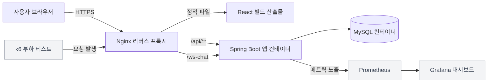
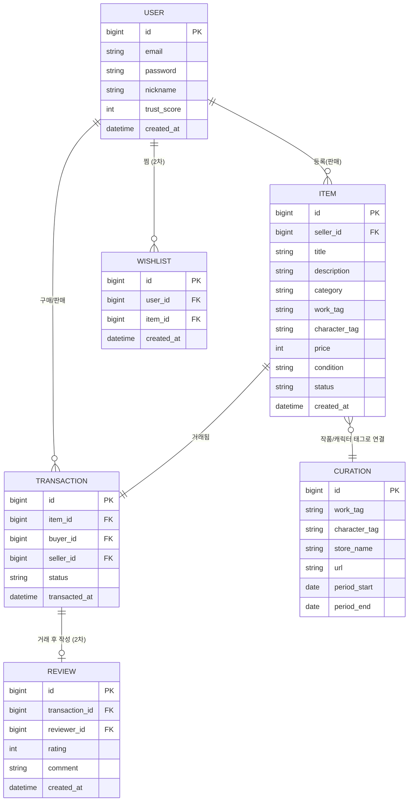
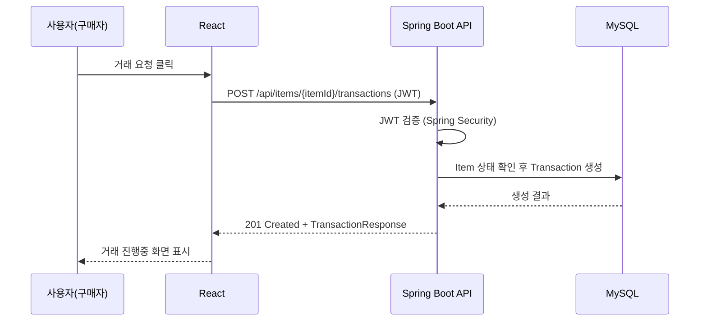
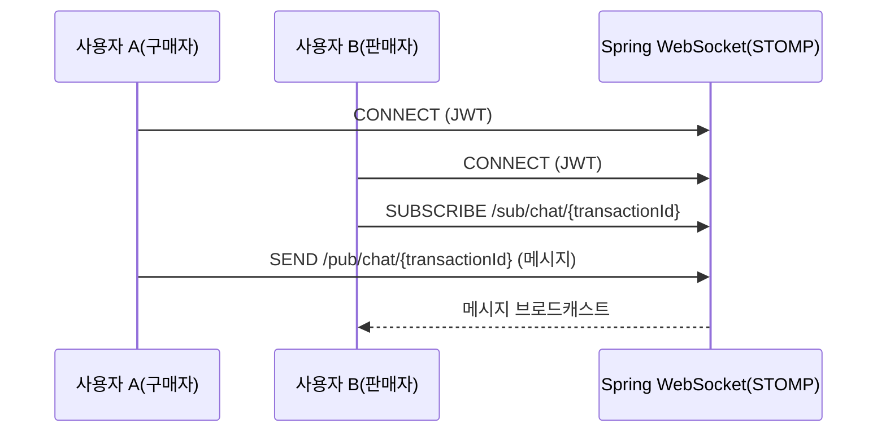

# 3. 아키텍처 및 서비스 흐름 — 오시마켓 (Oshi Market)

MVP 스코프([`1_MVP기획서.md`](./1_MVP기획서.md))와 기술 스택([`2_기술스택분석서.md`](./2_기술스택분석서.md))을 기반으로 한 시스템 설계.

## 1. 아키텍처 개요

단일 Spring Boot 애플리케이션 + 레이어드 아키텍처(Controller–Service–Repository). React(SPA)와 Spring Boot(REST API + WebSocket)를 분리하고, Docker로 컨테이너화해 AWS EC2에 배포.



모든 컨테이너(Spring Boot, MySQL, Prometheus, Grafana)는 EC2 한 대 위에서 Docker Compose로 함께 기동.

## 2. 패키지 구조 (도메인별)

```
com.oshimarket
 ├── domain
 │   ├── member         (회원)
 │   ├── item            (상품)
 │   ├── transaction     (거래)
 │   ├── curation        (큐레이션)
 │   ├── chat            (실시간 채팅, WebSocket/STOMP — 2차 개발, 담당: yjdev101)
 │   ├── review          (리뷰 — 2차 개발, 담당: xx-jhh)
 │   └── wishlist        (찜 — 2차 개발)
 │        └── [도메인별] controller / service / repository / entity / dto
 └── global
      ├── config         (Security, WebSocket, Swagger, Actuator 설정)
      ├── exception       (공통 예외 처리)
      ├── security        (JWT 필터/토큰 검증)
      └── common          (공통 응답 포맷 등)
```

**DTO/Entity 분리**: Entity는 순수 도메인 모델만 유지, Request/Response DTO는 Controller 레벨에서 사용, Service 계층에서 Entity ↔ DTO 변환.

**공통 예외처리**: `@RestControllerAdvice` + 커스텀 `BusinessException` 계층, 공통 에러 응답 포맷 `{ code, message, timestamp }`.

## 3. ERD



Item–Curation은 FK 대신 `work_tag`/`character_tag` 매칭으로 느슨하게 연결 (특정 상품이 여러 큐레이션 항목과 연관될 수 있어 유연성 우선).

## 4. API 명세

**회원 API**
- `POST /api/auth/signup`
- `POST /api/auth/login`
- `GET /api/members/me`
- `PATCH /api/members/me`

**상품 API**
- `POST /api/items`
- `GET /api/items` (필터: category, work, character, status)
- `GET /api/items/{itemId}`
- `PATCH /api/items/{itemId}`
- `DELETE /api/items/{itemId}`

**거래 API**
- `POST /api/items/{itemId}/transactions`
- `GET /api/transactions/{transactionId}`
- `PATCH /api/transactions/{transactionId}/status`
- `GET /api/members/me/transactions`

**큐레이션 API**
- `GET /api/curations` (필터: work, character)
- `GET /api/curations/{curationId}`

**리뷰 API** (2차 개발, 담당: xx-jhh)
- `POST /api/transactions/{transactionId}/reviews`
- `GET /api/members/{memberId}/reviews`

**실시간 채팅** (2차 개발, 담당: yjdev101, WebSocket + STOMP)
- 연결: `ws://.../ws-chat` (STOMP CONNECT 헤더에 JWT 포함, 서버 인터셉터가 검증)
- 발행: `/pub/chat/{transactionId}` — 클라이언트가 메시지 전송
- 구독: `/sub/chat/{transactionId}` — 거래 당사자(구매자/판매자)가 메시지 수신

상세 요청/응답 스펙은 SpringDoc OpenAPI(Swagger)로 자동 문서화 예정.

## 5. 서비스 흐름 (시퀀스)

**거래 요청 흐름**



**실시간 채팅 흐름** (2차 개발)



## 6. 인증 흐름 요약

- REST API: JWT Access Token을 `Authorization: Bearer` 헤더로 전달
- WebSocket(채팅): 연결 시 JWT로 핸드셰이크 인증, STOMP 세션 유지
